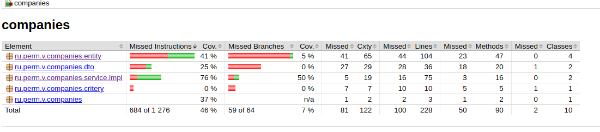
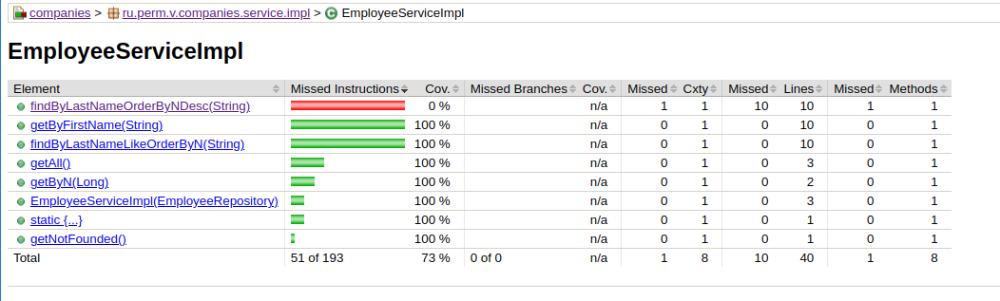
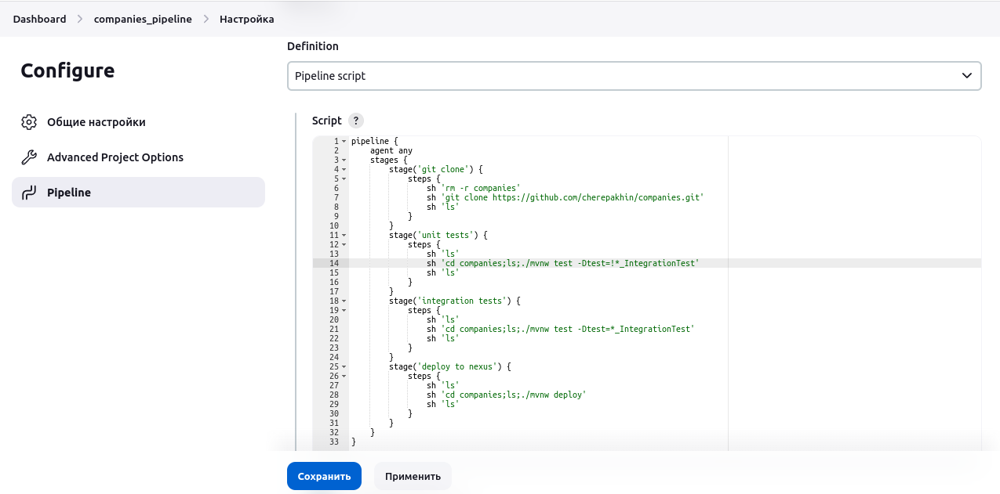

## Типовой проект "Tutorials" (backend)

Задание:<br/>
1. Создать новый пустой Spring (5) Java-проект Web-приложения с поддержкой Maven, Java 11.  
   Проект должен поддерживать подключение к PostgreSQL (12 и выше) и механизм миграций на базе Liquibase.  
   Необходимые настройки проекта (в том числе и параметры подключения к БД) должны храниться в профиле.
   При запуске проекта должны автоматически формироваться необходимые структуры данных в БД, а так же
   должны сразу же автоматически добавляться сами объекты тестовых данных (не менее 50 организаций, которые описаны в п.3). Должно поддерживаться открытие и запуск проекта в IntelliJ Idea.<br/>
2. В собранном web-приложении должна быть реализована REST-архитектура, предоставляющая доступ без авторизации к следующим web-методам:<br/>
   2.1 Метод получения списка объектов данных (описаны в п.3) в формате JSON с возможностью получения как всего списка данных, так и списка данных, отфильтрованного по переданной в этот метод поисковой строке.<br/>
   2.2 Метод получения одного объекта данных (описан в п.3) в формате JSON по его уникальному идентификатору.<br/>
5. Необходимо создать файл с описанием:<br/>
   5.1 Необходимых для запуска web-приложения настроек в профиле<br/>
   5.2 REST API web-приложения<br/>
6. Показать работу с БД разными способами (sql native запросы , qbe-запросы)<br/>
7. flyway database migration<br/>
8. Интеграционно протестировать<br/>
9. Кэши для REST<br/>
10. Docker<br/>
11. log<br/>
12. Профили для dev и prod<br/>

### Установка версии java:<br/>

в Linux:

````shell
export JAVA_HOME=/usr/lib/jvm/java-1.11.0-openjdk-amd64
````

в Windows:
(выполнять из cmd.exe)

````shell
C:\>echo %JAVA_HOME%
C:\po\jdk-21

Z:\prog\java\companies> export JAVA_HOME=c:\po\open-jdk11 ?????
````

Проверка:

````shell
$ ./mvnw -version

Apache Maven 3.6.3 (cecedd343002696d0abb50b32b541b8a6ba2883f)
Maven home: /home/vasi/.m2/wrapper/dists/apache-maven-3.6.3-bin/1iopthnavndlasol9gbrbg6bf2/apache-maven-3.6.3
Java version: 11.0.19, vendor: Ubuntu, runtime: /usr/lib/jvm/java-11-openjdk-amd64
Default locale: ru_RU, platform encoding: UTF-8
OS name: "linux", version: "5.4.0-150-generic", arch: "amd64", family: "unix"

````

### Использование базы данных

Используется программа psql из дистрибутива PostgreSQL.

````shell
$ psql --user=vasi --host=v  tutorial -W
````

Создание базы:

````shell
psql
# create database tutorial; 
````

Для подключения к БД используются user/password из переменных операционной системы PG_USER, PG_PASSWORD. По умолчанию значения обеих переменных 'postgres'.

Подключение через psql:

````shell
$ psql --user=vasi --host=v  tutorial -W
````

Подключение через psql с бД на хосте 192.168.1.20:

````shell
$ psql --user=vasi --host=v  tutorial -W
````

Backup:

````shell
pg_dump -U vasi -W tutorial > tutorial.backup
````

Restore:

````shell
psql -U vasi -d tutorial < tutorial.backup
````

После восстановления предоставить права:

````text
GRANT ALL PRIVILEGES ON DATABASE "tutorial" to vasi;
GRANT ALL PRIVILEGES ON ALL TABLES IN SCHEMA public TO vasi;

````


Для версионирования БД используется [flyway](https://flywaydb.org/). Автообновление БД отключено. В application.yaml установлен флаг: 

````yaml
flyway:
    enabled: false
````

Миграции в src/resources/migration. При изменении структуры вручную выполнить:

````shell
$ ./mvnw flyway:migrate -Dflyway.user=vasi -Dflyway.password=pass -Dflyway.url=jdbc:postgresql://192.168.1.20:5432/tutorial
````

### Тестирование

Прогон всех тестов (включая интеграционные):

````shell
$ ./mvnw test

Tests run: 15, Failures: 0, Errors: 0, Skipped: 0
````

Прогон только интеграционных тестов:

````shell
$ ./mvnw test -Dtest=*_IntegrationTest

Tests run: 9, Failures: 0, Errors: 0, Skipped: 0
````

Прогон только unit тестов:

````shell
$ ./mvnw test -Dtest=\!*_IntegrationTest 

Tests run: 6, Failures: 0, Errors: 0, Skipped: 0
````
Из Windows:
````shell
./mvnw test -Dtest=!*_IntegrationTest
.\mvnw.cmd test -Dtest=!*_IntegrationTest
````

Прогон конкретного тестового класса:

````shell
./mvnw test -Dtest=CompanyServiceImplTest -DfailIfNoTests=false
````

NOTE: No tests were executed!  -DfailIfNoTests=false to ignore this error

Прогон конкретного метода конкретного тестового класса:

````shell
./mvnw test -Dtest="CompanyServiceImplTest#getAll"
./mvnw test -Dtest="EmployeeServiceImpl_IntegrationTest#findByLastNameLikeOrderByN"
./mvnw test -Dtest=CompanyServiceImplTest#getAll
````

Разные варианты прогона тестов:

````shell
./mvnw test -Dtest=*ImplTest -DfailIfNoTests=false
./mvnw test -Dtest=*IntegrationTest -DfailIfNoTests=false
````

Прогон теста в Windows:

````shell
// из cmd.exe
companies>echo %JAVA_HOME%
C:\po\jdk-21 
// из PowerShell
companies>.\mvnw.cmd test -Dtest=*_IntegrationTest
companies>.\mvnw.cmd test -Dtest=!*_IntegrationTest
companies>.\mvnw.cmd test
````

Сборка без тестов:

````shell
./mvnw package -DskipTests
````

### Покрытие тестами

Использован [jacoco](https://www.eclemma.org/jacoco/). Генерация отчета:

````shell
$./mvnw test
$./mvnw jacoco:report
````

Отчет будет в папке target/site/jacoco/index.html



Пример отчета по конкретному классу:



Красным или желтым выделены непротестированные участки кода.

### Запуск проекта

````shell
$./mvnw clean spring-boot:run
````

### Логирование

Сделана настройка вывода протоколв работы через logback в папку logs. Настройки в файле resources/logback-spring.xml

### Конфигурации (spring profiles)

Конфигурация для разработки расположена в application-dev.yml, для production версии в application-prod.yml. С какой конфигурацией запускать указано в application.yml

````yaml
spring:
  profiles:
    active: dev
````

Профиль можно указать при запуске:

````shell
$java -jar target/companies-0.0.1-SNAPSHOT.jar --spring.profiles.active=prod
````

### Validate DTO

````shell
http POST :8080/api/employee/validate < src/test/test_jsons/empl_err1.json
HTTP/1.1 400 
Connection: close
Content-Type: application/json
Date: Mon, 23 Oct 2023 07:24:22 GMT
Transfer-Encoding: chunked

{
    "errors": [
        "field: firstname, error: Firstname empty"
    ],
    "message": "Errors in input dto: EmployeeDto{n=null, firstname='', lastname='LASTNAME_31', fathername='FATHERNAME_31', birthday='2023/01/01'}",
    "status": "BAD_REQUEST"
}
````

### Ручная проверка REST

Проверка ответа при ошибке:

```shell
$ http :8080/api/company/1000

HTTP/1.1 502 
Connection: keep-alive
Content-Length: 25
Content-Type: text/plain;charset=UTF-8

Company not found id=1000
```

app.log:

````text
ERROR [http-nio-8080-exec-1] ru.perm.v.companies.rest.CompanyRest: Company not found id=1000
````

### ResponseEntity

Показаны разные способы возврата ошибки.

1) Простой:

CompanyRest.deleteById(...)

````java
    @DeleteMapping("/{id}")
    public ResponseEntity<Long> deleteById(@PathVariable Long id) {
        try {
            companyService.deleteById(id);
            return ResponseEntity.ok(id);
        } catch (Exception e) {
            log.error(e.getMessage());
            return new ResponseEntity(e.getMessage(), HttpStatus.BAD_GATEWAY);
        }
    }
````

2) И через ApiError:

EmployeeRest.update():

````java
        if (errors.size() > 0) {
            ApiError apiError =
                    new ApiError(HttpStatus.BAD_REQUEST, String.format("Errors in input dto: %s", dto), errors);
            return new ResponseEntity(
                    apiError, new HttpHeaders(), apiError.getStatus());
        }

````

### CI/CD

Скрипт Jenkinsfile для сборки для Jenkins. Вставлены некоторые команды для отладки и понятия работы Jenkinsfile:

````yaml
pipeline {
    agent any
    options {internal 
        durabilityHint 'MAX_SURVIVABILITY'
    }
    stages {
        stage('git clone') {
            steps {
                sh 'pwd'
                sh 'rm -rf compaines'
                sh 'git clone https://github.com/cherepakhin/companies.git'
                sh 'ls'
            }
        }
        stage('unit tests') {
            steps {
                sh 'ls'
                sh 'cd companies;chmod +x mvnw;ls -al;pwd'
                sh 'pwd;ls -al;cd companies;./mvnw test -Dtest=!*_IntegrationTest'
                sh 'ls'
            }
        }
        stage('deploy to nexus') {
            steps {
                sh 'ls'
                sh 'cd companies;ls;./mvnw -Dmaven.test.skip=true deploy'
                sh 'ls'
            }
        }
    }
}

````

Примечание: каждый sh в stage начинает работу от рабочего каталога проекта Jenkins (см. stage('unit tests')): 

````text
 sh 'ls'
 sh 'cd companies;chmod +x mvnw;ls -al;pwd'
 sh 'pwd;ls -al;cd companies;./mvnw test -Dtest=!*_IntegrationTest'
 sh 'ls'
````



Jenkins user: vasi<br/>
Jenkins password: pass<br/>

Deploy:

```shell
./mvnw deploy
````


### Примечания:

Для гибкой работы с СУБД используется [http://querydsl.com/](http://querydsl.com/)

### Ссылки

[Optional: Кот Шрёдингера в Java 8](https://habr.com/ru/articles/346782/)
[Integration Tests With Maven(dzone)](https://dzone.com/articles/integration-tests-with-maven)
[example project](https://github.com/gkatzioura/egkatzioura.wordpress.com/tree/master/IntegrationTestMaven/src)

### Разное

[IntelliJ IDEA's top keyboard shortcuts](https://www.jetbrains.com/help/idea/reference-keymap-win-default.html)

keyboard shortcuts:
Alt-F12 - переход в терминал  

Разные варианты LIKE [https://www.baeldung.com/spring-jpa-like-queries](https://www.baeldung.com/spring-jpa-like-queries)

Неожиданно стал СИЛЬНО ТОРМОЗИТЬ запуск тестов в Idea. Удалил папку ".idea". 

Просмотр и установка переменных в Windows из PowerShell:

````shell
C:\>$env:PG_USER="vasi"
C:\>ls env:
C:\>> ls env:PG_USER

Name                           Value
----                           -----
PG_USER                        vasi
````

Перестройка миграций flyway(при ошибках "Flyway: Found non-empty schema(s) "public" without schema history table! Use baseline() - on Empty database") установить в application.yaml: 

````
spring:
   flyway:
      baseline-on-migrate = true
````

Очистка flyway:

````shell
./mvnw flyway:clean
````

Провести миграции:

````shell
./mvnw flyway:migrate
````
